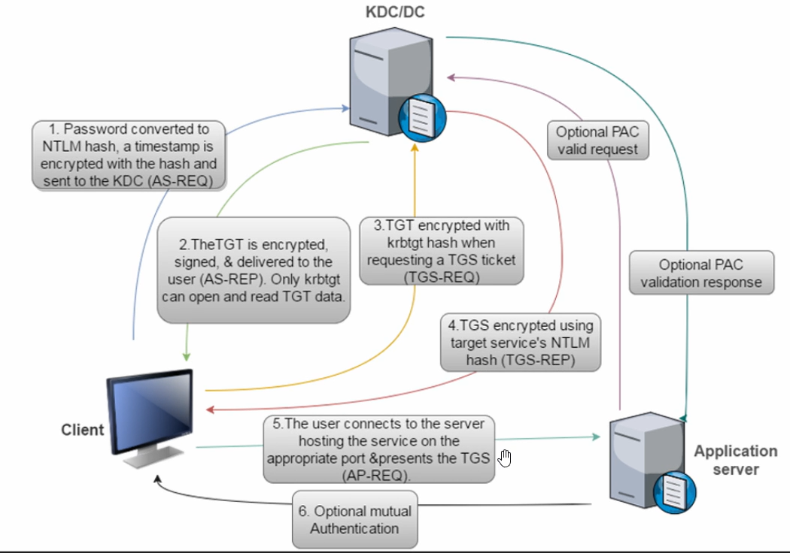
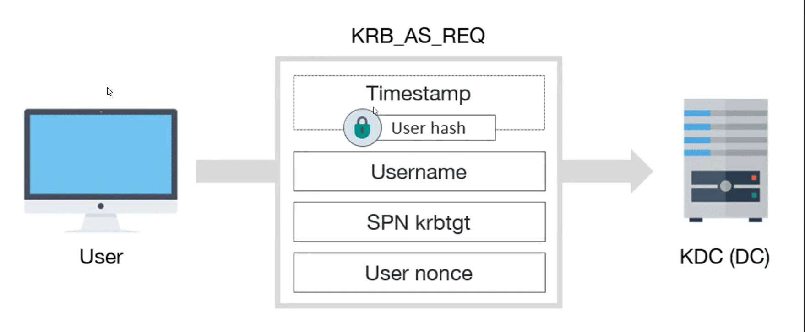
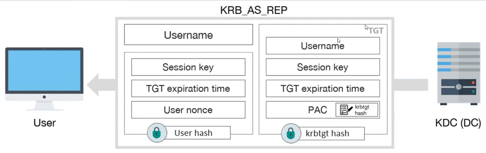
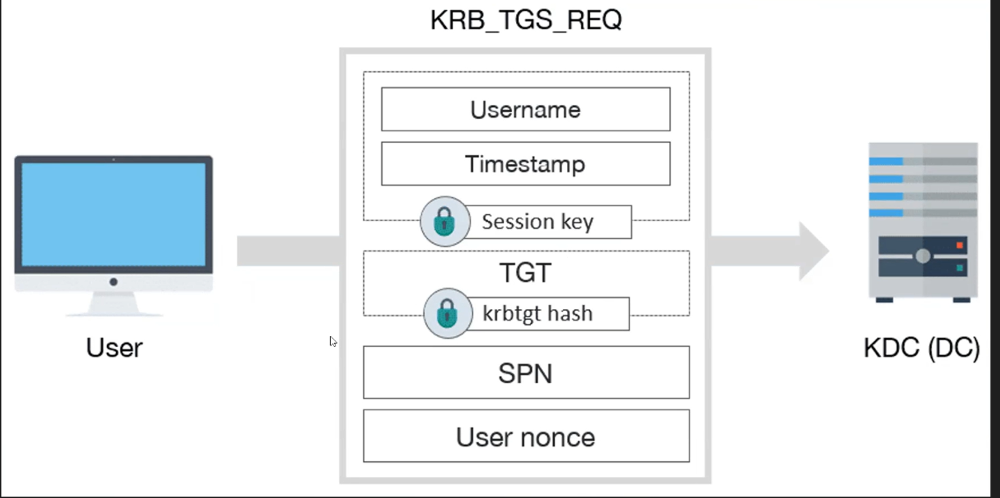
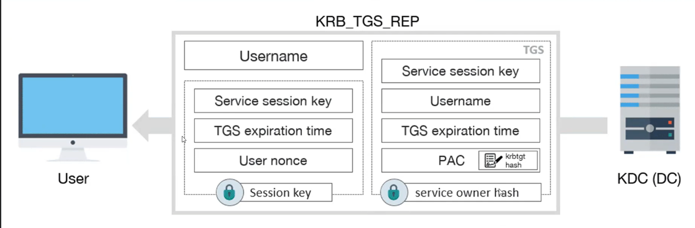
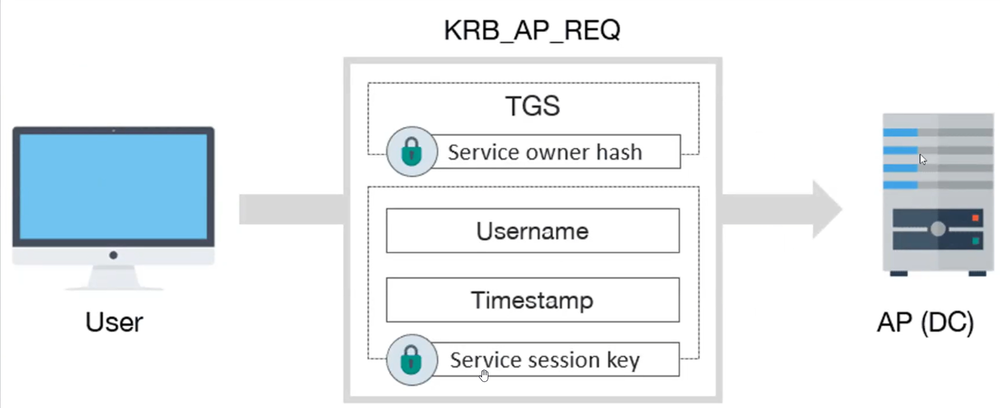

# 🎟️Kerberos — Complete Breakdown

### <mark style="color:$primary;">What Kerberos Is</mark>

Kerberos is the primary <mark style="color:blue;">authentication protocol</mark> in Active Directory. It is ticket-based, stateless, and designed to allow two parties to authenticate to each other over an insecure network — as long as both trust a third party, the KDC.

**Named after** the three-headed dog from Greek mythology — because it has <mark style="color:red;">three components</mark>: the <mark style="color:$warning;">client, the service</mark>, and the <mark style="color:$warning;">KDC</mark>.

**Developed by** MIT. Adopted by Microsoft for Active Directory.

***

### <mark style="color:$primary;">The Movie Theatre Analogy</mark>

Kerberos makes more sense with an analogy before diving into the mechanics.

Imagine an all-you-can-watch movie theatre:

```
Step 1 — Getting your pass (TGT):
  You show your ID at the front desk
  They verify who you are
  They give you a special movie pass
  The pass proves you're a valid customer

Step 2 — Getting your ticket (Service Ticket):
  You go to the ticket booth and show your pass
  The booth checks the pass is valid and not expired
  They give you a paper ticket for a specific movie

Step 3 — Entering the theatre (AP-REQ):
  You show the paper ticket at the theatre door
  The door agent checks the ticket only — not your ID, not your pass
  If the ticket is valid for this movie at this time, you're in

Key insight:
  The ticket booth doesn't know or care if you deserve to watch the movie
  That decision belongs to the door agent
  The ticket booth just validates your pass and issues tickets
```

<mark style="background-color:blue;">This maps exactly to Kerberos. The ticket booth is the KDC. The door agent is the application server. The access decision belongs entirely to the service — not the KDC.</mark>

***

### <mark style="color:$danger;">Key Terminology</mark>

| Term                                                         | Definition                                                                                                     |
| ------------------------------------------------------------ | -------------------------------------------------------------------------------------------------------------- |
| <mark style="color:$warning;">**KDC**</mark>                 | Key Distribution Center. Logical role on the DC. Contains the AS and TGS.                                      |
| <mark style="color:$warning;">**AS**</mark>                  | Authentication Server. Part of KDC. Handles Phase 1 — issues TGTs.                                             |
| <mark style="color:$warning;">**TGS**</mark>                 | Ticket Granting Service. Part of KDC. Handles Phase 2 — issues Service Tickets.                                |
| <mark style="color:$warning;">**TGT**</mark>                 | Ticket Granting Ticket. Your "movie pass." Encrypted with krbtgt hash. Valid 10 hours by default.              |
| <mark style="color:$warning;">**ST / Service Ticket**</mark> | Ticket for a specific service. Encrypted with the target service account's hash.                               |
| <mark style="color:$warning;">**PAC**</mark>                 | Privilege Attribute Certificate. Embedded in every ticket. Contains User SID, Group SIDs, and privilege flags. |
| <mark style="color:$warning;">**SPN**</mark>                 | Service Principal Name. Unique identifier for a service. Format: `service_class/hostname`.                     |
| <mark style="color:$warning;">**krbtgt**</mark>              | The KDC's own service account. Its NT hash encrypts all TGTs. Compromise = Golden Ticket.                      |
| <mark style="color:$warning;">**Session Key**</mark>         | Temporary symmetric key negotiated between client and KDC. Used to encrypt authenticators.                     |
| <mark style="color:$warning;">**Authenticator**</mark>       | A timestamp encrypted with the session key. Proves the client still holds the session key.                     |

***

### <mark style="color:$danger;">The Three Long-Term Keys</mark>

Kerberos uses three long-term secret keys throughout the protocol. Understanding which key is used where is essential for understanding attacks.

| Owner                                        | Key (password hash)       | Used For                                                    |
| -------------------------------------------- | ------------------------- | ----------------------------------------------------------- |
| <mark style="color:$warning;">KDC</mark>     | `krbtgt` NT hash          | Encrypt TGT · Sign PAC in AS-REP and TGS-REP                |
| <mark style="color:$warning;">Client</mark>  | User's NT hash            | Encrypt timestamp in AS-REQ · Decrypt session key in AS-REP |
| <mark style="color:$warning;">Service</mark> | Service account's NT hash | Encrypt service portion of ST · Sign PAC in TGS-REP         |

***

### <mark style="color:$primary;">The Complete Authentication Flow</mark>

<figure><figcaption></figcaption></figure>

#### <mark style="color:$primary;">Phase 1 — Getting a TGT</mark>

<figure><figcaption></figcaption></figure>

<figure><figcaption></figcaption></figure>

After this step, the client has:

* <mark style="background-color:blue;">A TGT (cannot read it — encrypted with krbtgt hash)</mark>
* <mark style="background-color:blue;">A Session Key (can read it — encrypted with own hash)</mark>

***

#### <mark style="color:$primary;">Phase 2 — Getting a Service Ticket</mark>

<figure><figcaption></figcaption></figure>

<figure><figcaption></figcaption></figure>


***

#### <mark style="color:$primary;">Phase 3 — Accessing the Service</mark>

<figure><figcaption></figcaption></figure>


```
CLIENT                                    APPLICATION SERVER
  │                                               │
  │ ──⑤ AP-REQ ─────────────────────────────────►│
  │      Service Ticket                           │ Decrypts with own hash
  │      Authenticator:                           │ Reads PAC
  │        Username + Timestamp                   │ Validates signature
  │        encrypted with Service Session Key     │ Checks permissions
  │                                               │ Grants or denies access
  │ ◄─⑥ AP-REP (optional mutual auth) ───────────│
```

The application server now knows:

* Who the user is (username from ticket)
* What groups they belong to (PAC)
* Whether they should have access (its own ACL check against PAC data)

***

### <mark style="color:$primary;">What's Inside Each Ticket</mark>

#### <mark style="color:$info;">TGT — Only the KDC can read this</mark>

```
┌──────────────────────────────────────┐
│  Username                            │
│  Session Key                         │
│  TGT Expiry Time (default: 10 hours) │  Encrypted with
│  User Nonce                          │  krbtgt NT hash
│  PAC                                 │
│    └─ User SID                       │
│    └─ Group SIDs                     │
│    └─ Logon info                     │
│    └─ Privilege flags                │
│  Signed with krbtgt hash             │
└──────────────────────────────────────┘
```

#### <mark style="color:$primary;">Service Ticket — Only the target service can read this</mark>

```
┌──────────────────────────────────────┐
│  Username                            │
│  Service Session Key                 │
│  TGS Expiry Time                     │  Encrypted with
│  User Nonce                          │  service account
│  PAC                                 │  NT hash
│    └─ User SID                       │
│    └─ Group SIDs                     │
│    └─ Logon info                     │
│  Signed with krbtgt hash             │
└──────────────────────────────────────┘
```

***

### <mark style="color:$primary;">The PAC — Privilege Attribute Certificate</mark>

The PAC is what connects authentication (who you are) to authorisation (what you can do).

The KDC creates it and embeds it in every ticket. It contains:

* <mark style="color:red;">**User SID**</mark> — unique identifier for the user
* <mark style="color:red;">**Group SIDs**</mark> — every group the user belongs to, including nested groups
* <mark style="color:red;">**Logon information**</mark> — username, domain, logon time
* <mark style="color:red;">**Privilege flags**</mark> — special rights (e.g. SeDebugPrivilege)

When the application server receives the Service Ticket, it extracts the PAC and uses the SIDs inside it to make access control decisions. It compares the user's SIDs against its own ACLs.

<mark style="background-color:blue;">**Key insight:**</mark> <mark style="background-color:blue;"></mark><mark style="background-color:blue;">The PAC is signed by the KDC but the application server validates it locally. This is why Golden Tickets work — if you forge a TGT with a fraudulent PAC, you control what SIDs the service sees.</mark>

***

### <mark style="color:$primary;">The Critical Design Decision</mark>

```
The KDC does not decide if you should have access to a service.

It issues Service Tickets to any authenticated user for any SPN.
No permission check. No ACL lookup. No verification of entitlement.

The service is entirely responsible for access control
using the PAC data inside the ticket.

This is intentional. If the KDC enforced access control,
it would need to know the permissions on every file,
database record, and resource across the entire domain.
That would be impossible to scale.

This design decision is exactly what Kerberoasting exploits.
Any domain user can request a Service Ticket for any SPN —
including SPNs tied to service accounts with weak passwords.
```

***

### <mark style="color:$primary;">Kerberos Event IDs</mark>

| Event ID | Trigger                            | Security Significance                                           |
| -------- | ---------------------------------- | --------------------------------------------------------------- |
| 4768     | TGT requested (AS-REQ)             | Pre-auth disabled on account = AS-REP Roasting target           |
| 4769     | Service ticket requested (TGS-REQ) | EncryptionType 0x17 (RC4) = Kerberoasting in progress           |
| 4770     | Service ticket renewed             | Low priority, normal operation                                  |
| 4771     | Kerberos pre-auth failed           | Repeated = brute force or account enumeration                   |
| 4624     | Successful logon                   | Logon Type 3 (network) with Kerberos = ticket used successfully |

***

### <mark style="color:$danger;">Defensive Takeaways</mark>

| Control                                              | Why It Matters                                                      |
| ---------------------------------------------------- | ------------------------------------------------------------------- |
| Enforce AES-256 Kerberos encryption                  | Disabling RC4 prevents Kerberoasting downgrade attacks              |
| Use gMSA for service accounts                        | Auto-rotating 120-char passwords make Service Tickets uncrackable   |
| Alert on Event 4769 with EncryptionType 0x17         | RC4 service ticket request is the Kerberoasting signature           |
| Rotate krbtgt password twice after any DC compromise | Single rotation leaves Golden Tickets valid                         |
| Monitor for abnormal TGS volume                      | Single user requesting many service tickets rapidly = Kerberoasting |
| Audit SPNs tied to user accounts                     | Every user SPN is a Kerberoasting target — minimise them            |
