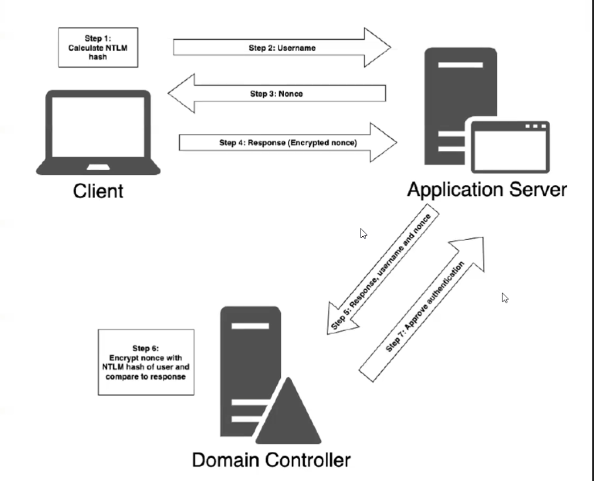

# 🗝️NTLMv2 Protocol

### <mark style="color:$primary;">What NTLMv2 Is</mark>

<mark style="color:blue;">NTLMv2 is the challenge/response authentication protocol Windows uses when authenticating to remote services — when Kerberos is unavailable or not applicable.</mark>

<mark style="color:red;">**The core guarantee**</mark>**:** the password never travels across the network. Ever. <mark style="color:blue;">The NT hash is used as a key to prove knowledge of the password, not to transmit it.</mark>

***

### <mark style="color:$primary;">Local Authentication First — The Baseline</mark>

Understanding remote authentication starts with understanding local authentication, which is simpler:

```
User types password at the login screen
               │
               ▼
PC hashes the input using MD4
Result: NT Hash
               │
               ▼
Compare against NT hash stored in local SAM file
               │
         ┌─────┴─────┐
      Match         No match
         │               │
   ✅ Logged in      ❌ Access denied
```

No network traffic. No server involved. The machine is its own authority for local accounts.

***

### <mark style="color:$primary;">NTLMv2 Remote Authentication — The Full Flow</mark>

<mark style="color:red;">When you authenticate to a remote resource</mark> — <mark style="color:blue;">a file share, an application server, a web service — the machine cannot validate you locally. It needs the Domain Controller to do it.</mark>

<figure><figcaption></figcaption></figure>

***

### <mark style="color:$primary;">What Actually Travels on the Network</mark>

This is the most important thing to understand about NTLMv2:

```
What travels:                   What does NOT travel:
─────────────────────           ─────────────────────
✓ Username (plaintext)          ✗ Password (never)
✓ Server challenge (random)     ✗ NT Hash (never directly)
✓ Client challenge (random)
✓ NTLMv2 response (hashed)
```

The NTLMv2 response is a hash. <mark style="color:blue;">It can be captured by an attacker</mark> on the network. <mark style="color:blue;">It cannot be used directly for authentication</mark> — but it <mark style="color:blue;">**can be cracked offline**</mark>. This captured value is called a <mark style="color:red;">**NetNTLMv2 hash**</mark>, and it is what tools like Responder capture.

***

### <mark style="color:$primary;">The Responder Attack — Why This Matters</mark>

Windows machines constantly broadcast name resolution requests on the local network. When a machine can't resolve a hostname via DNS, it broadcasts a request asking "does anyone know where this host is?"

An attacker running **Responder** responds to these broadcasts, pretending to be the requested host. The victim machine sends NTLMv2 authentication to the attacker. The attacker captures the NetNTLMv2 hash and cracks it offline.

```
Victim PC broadcasts: "Who is FILESERVER?"
Responder replies:    "I am FILESERVER"
Victim PC sends:      NTLMv2 authentication attempt
Attacker captures:    NetNTLMv2 hash → crack offline
```

No vulnerability exploited. Just the protocol working as designed.

***

### <mark style="color:$primary;">When Windows Falls Back to NTLM</mark>

Kerberos is the preferred protocol. Windows only falls back to NTLMv2 when Kerberos fails:

```
Kerberos fails when:
  • Authenticating to an IP address instead of a hostname
    (Kerberos requires a hostname to look up the SPN)
  • Target machine is not domain-joined
  • Kerberos port 88 is blocked by firewall
  • Time difference between client and DC exceeds 5 minutes
  • No SPN registered for the target service

In all these cases:
  Windows silently falls back to NTLMv2
  No error shown to the user
```

High NTLM usage in an environment that should be using Kerberos is an indicator worth investigating.

***

### <mark style="color:$danger;">NTLMv1 vs NTLMv2 vs LM</mark>

| Property          | LM      | NTLMv1    | NTLMv2                     |
| ----------------- | ------- | --------- | -------------------------- |
| Hash used         | LM Hash | NT Hash   | NT Hash                    |
| Challenge size    | 8 bytes | 8 bytes   | 8 bytes + client challenge |
| Algorithm         | DES     | MD4 + DES | HMAC-MD5                   |
| Crackability      | Trivial | Easy      | Harder, but possible       |
| Should be enabled | Never   | Never     | Only as Kerberos fallback  |

***

### <mark style="color:$danger;">Defensive Takeaways</mark>

| Control                        | How to Apply                                                           | What It Prevents                      |
| ------------------------------ | ---------------------------------------------------------------------- | ------------------------------------- |
| SMB Signing                    | Group Policy → Microsoft network server: Digitally sign communications | NTLM relay attacks                    |
| LDAP Signing + Channel Binding | Group Policy → Domain controller: LDAP server signing requirements     | LDAP relay attacks                    |
| NTLMv2 minimum level           | Group Policy → LAN Manager authentication level → NTLMv2 only          | Downgrades to weaker protocols        |
| Disable LLMNR and NBT-NS       | Group Policy + registry                                                | Prevents Responder-style hash capture |
| Monitor Event 4776             | Alert on high volume from single source                                | Brute force and relay detection       |
| Prefer Kerberos                | Ensure SPNs are registered, use hostnames not IPs                      | Reduces NTLM attack surface           |
